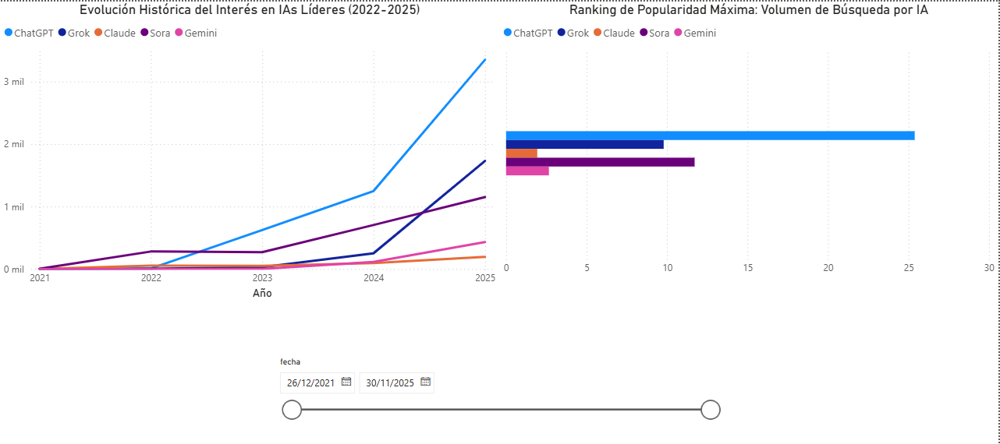

# 📈 Análisis de Tendencias de IA (2022 - 2025)

## 📝 Descripción del Proyecto
Este proyecto es un análisis integral del interés de búsqueda en Google Trends para las principales herramientas de Inteligencia Artificial (ChatGPT, Gemini, Claude, Sora, Grok y Midjourney). El objetivo es entender cómo los lanzamientos y anuncios oficiales impactan en la relevancia de estas tecnologías en el mercado global.

El flujo de trabajo abarca desde la **extracción automatizada de datos** mediante Python hasta la creación de un **Dashboard interactivo** en Power BI.

---

## 🛠️ Tecnologías Utilizadas
* **Python**: Extracción y procesamiento de datos.
* **Pandas**: Limpieza y normalización de datasets.
* **Git/GitHub**: Control de versiones y despliegue de documentación.
* **Power BI**: Modelado de datos y visualización interactiva.

---

## 🚀 Fases del Proyecto

### 1. Extracción y Limpieza (Python)
Se utilizaron Notebooks de Jupyter para interactuar con los datos. El proceso incluyó:
* Descarga de series temporales de interés de búsqueda.
* **Tratamiento de fechas**: Conversión de tipos de datos para asegurar una línea de tiempo continua.
* **Normalización**: Ajuste de escalas para comparar herramientas con diferentes volúmenes de tráfico.
* Exportación de los datos limpios a formato `.csv` para su consumo en BI.

### 2. Visualización y BI (Power BI)
Se diseñó un Dashboard enfocado en la experiencia de usuario (UX) con los siguientes elementos:
* **Evolución Histórica**: Un gráfico de líneas que permite ver el crecimiento exponencial de la IA.
* **Ranking de Popularidad**: Comparativa del interés promedio para identificar líderes de mercado.
* **Filtros Dinámicos**: Implementación de un segmentador de rango de fechas ("Slicer") que permite analizar periodos específicos con precisión diaria.

---

## 📊 Conclusiones del Análisis
Tras analizar los datos obtenidos, se destacan los siguientes hallazgos:

1. **Hegemonía de ChatGPT**: A pesar de la aparición de nuevos competidores, ChatGPT mantiene una base de interés muy superior al resto, actuando como el estándar de la industria.
2. **Impacto de la Novedad**: Herramientas como **Sora** muestran picos de búsqueda extremadamente agresivos en periodos cortos, coincidiendo con sus anuncios de capacidades de video, lo que demuestra una alta sensibilidad del mercado a la innovación visual.
3. **Consolidación de Competidores**: **Gemini** (Google) y **Claude** (Anthropic) muestran una tendencia de crecimiento más estable, posicionándose como las alternativas más sólidas en el ámbito de la productividad.
4. **Volatilidad**: El interés en herramientas específicas de generación de imagen (como Midjourney) es más cíclico comparado con las IAs generativas de texto/multimodales.

---

## 📂 Estructura del Repositorio
* `*.ipynb`: Notebooks con el código de extracción y limpieza.
* `*.csv`: Datasets procesados listos para análisis.
* `reporte_tendencias_ia.pbix`: Archivo fuente de Power BI.
* `dashboard.png`: Captura de pantalla del informe final.

---
**Autor:** Carlos Escribano Merino
**Fecha:** 2026 
*Proyecto desarrollado como parte de un flujo completo de Data Analytics.*